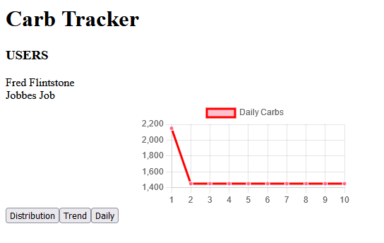

<div id="top">

<!-- PROJECT LOGO -->
<br />
<div align="center">

<h3 align="center"><strong>Carb Tracker</strong></h3>

  <p align="center">
    An app that provides analytics on carbohydrate intake.
    <br />
    <a href="https://github.com/leewes5928/carb_tracker"><strong>Explore the docs »</strong></a>
    <br />
    <br />
    <a href="https://github.com/leewes5928/carb_tracker/issues">Report Bug</a>
    ·
    <a href="https://github.com/leewes5928/carb_tracker/issues">Request Feature</a>
  </p>
</div>


<!-- TABLE OF CONTENTS -->
<details>
  <summary>Table of Contents</summary>
  <ol>
    <li>
      <a href="#about-the-project">About The Project</a>
      <ul>
        <li><a href="#built-with">Built With</a></li>
      </ul>
    </li>
    <li>
      <a href="#getting-started">Getting Started</a>
      <ul>
        <li><a href="#prerequisites">Prerequisites</a></li>
        <li><a href="#installation">Installation</a></li>
      </ul>
    </li>
    <li><a href="#contributing">Contributing</a></li>
    <li><a href="#author">Author</a></li>
  </ol>
</details>


<!-- ABOUT THE PROJECT -->
## About The Project

This application communicates with a [Ruby on Rails API](https://github.com/leewes5928/carb_api) to display charts in AngularJS for carbohydrates of a user. 

<p align="right">(<a href="#top">back to top</a>)</p>


### Built With

* [Angular](https://angular.io/)
* [Chart.js](https://www.chartjs.org/)
* [ng2-charts](https://www.npmjs.com/package/ng2-charts)
* [RxJs](https://rxjs.dev/)

<p align="right">(<a href="#top">back to top</a>)</p>


<!-- GETTING STARTED -->
## Getting Started

To get a local copy up and running follow these steps.

### Prerequisites
1. Install Angular CLI
2. Install PostgreSQL
3. Clone and run server [Here](https://github.com/leewes5928/carb_api)

### Installation

1. Clone the repo
   ```sh
   git clone https://github.com/leewes5928/carb_tracker.git
   ```
2. Install NPM packages
   ```sh
   npm install
   ```
3. Run the application locally
   ```sh
   npm start
   ```

The application should now be running locally on http://localhost:4200


<p align="right">(<a href="#top">back to top</a>)</p>


<!-- CONTRIBUTING -->
## Contributing

If you have a suggestion that would make this better, please fork the repo and create a pull request. You can also open an issue with the tag "enhancement".

1. Fork the Project
2. Create your Feature Branch (`git checkout -b feature/NewFeature`)
3. Commit your Changes (`git commit -m 'Add some NewFeature.'`)
4. Push to the Branch (`git push origin feature/NewFeature`)
5. Open a Pull Request

<p align="right">(<a href="#top">back to top</a>)</p>


<!-- CONTACT -->
## Author

Wesley Lee - [leewes5928](https://github.com/leewes5928/)

Project Link: [https://github.com/leewes5928/carb_tracker](https://github.com/leewes5928/carb_tracker)

<p align="right">(<a href="#top">back to top</a>)</p>


<!-- MARKDOWN LINKS & IMAGES -->
<!-- https://www.markdownguide.org/basic-syntax/#reference-style-links -->
[contributors-shield]: https://img.shields.io/github/contributors/leewes5928/carb_tracker.svg?style=for-the-badge
[contributors-url]: https://github.com/leewes5928/carb_tracker/graphs/contributors
[forks-shield]: https://img.shields.io/github/forks/leewes5928/carb_tracker.svg?style=for-the-badge
[forks-url]: https://github.com/leewes5928/carb_tracker/network/members
[stars-shield]: https://img.shields.io/github/stars/leewes5928/carb_tracker.svg?style=for-the-badge
[stars-url]: https://github.com/leewes5928/carb_tracker/stargazers
[issues-shield]: https://img.shields.io/github/issues/leewes5928/carb_tracker.svg?style=for-the-badge
[issues-url]: https://github.com/leewes5928/carb_tracker/issues
[license-shield]: https://img.shields.io/github/license/leewes5928/carb_tracker.svg?style=for-the-badge
[license-url]: https://github.com/leewes5928/carb_tracker/blob/master/LICENSE.txt
[linkedin-shield]: https://img.shields.io/badge/-LinkedIn-black.svg?style=for-the-badge&logo=linkedin&colorB=555
[linkedin-url]: https://linkedin.com/in/linkedin_username
[product-screenshot]: images/screenshot.png
